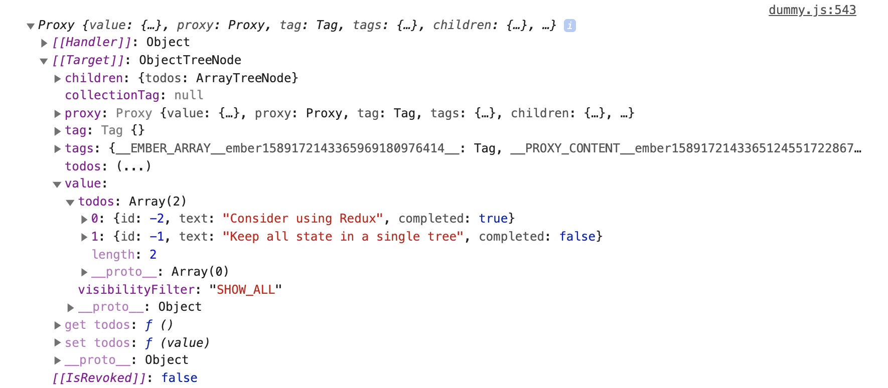

Tracked Redux
==============================================================================

This library provides an autotracked version of [Redux](https://redux.js.org/).

```js
import { createStore } from 'tracked-redux';

const store = createStore((state = { todos: [] }, action) => {
  if (action.type === 'ADD_TODO') {
    return { todos: [...state.todos, action.todo] };
  }

  return state;
});

class Example extends Component {
  get todos() {
    return store.getState().todos;
  }

  @action addTodo(todo) {
    store.dispatch({ type: 'ADD_TODO', todo });
  }
}
```

The API is the same as Redux in every way, with the only difference being that
the state tree returned by `getState` is deeply autotracked. Accessing values on
it will entangle with any autotracking that is active. When actions are
dispatched and the state tree is updated, only the values that are _changed_
will dirty.

For more detailed usage instructions an examples, see the
[Redux documentation](https://redux.js.org/introduction/getting-started).

Usage as a Standard Package
------------------------------------------------------------------------------

Tracked Redux ships with Ember Addon settings for usage in Ember with zero
configuration. However, it should also be usable as a standard NPM package.
Modules are provided using ES2017, and standard bundlers should be able to work
with them.

Compatibility
------------------------------------------------------------------------------

* Ember.js v3.16 or above
* Ember CLI v2.13 or above
* Node.js v10 or above
* Last two versions of Chrome, Safari, Firefox, Edge

Installation
------------------------------------------------------------------------------

Using NPM:

```
npm install --save tracked-redux
```

Using Yarn:

```
yarn add tracked-redux
```

Debugging
------------------------------------------------------------------------------

Tracked Redux works by using [JavaScript Proxies](https://developer.mozilla.org/en-US/docs/Web/JavaScript/Reference/Global_Objects/Proxy),
which is how it is able to only dirty the state that has actually changed in the
state tree. However, proxies do not display well in the console:



Tracked Redux ships with a custom console formatter for Chrome devtools to make
these proxies appear nicer and easier to understand:


Custom formatters have to be enabled in the devtools settings:


Contributing
------------------------------------------------------------------------------

See the [Contributing](CONTRIBUTING.md) guide for details.


License
------------------------------------------------------------------------------

This project is licensed under the [MIT License](LICENSE.md).
